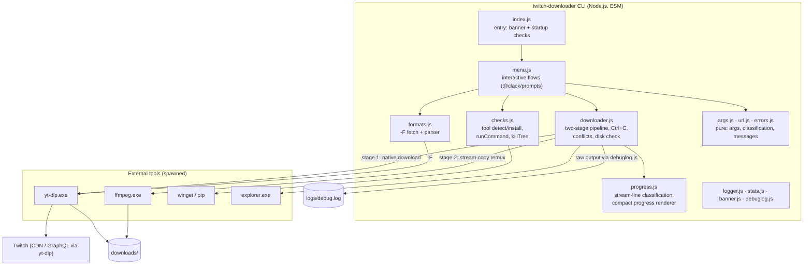

# System Map

<!-- Update this diagram BEFORE implementing architectural changes.
     This is the source of truth for project architecture. -->

## Architecture

## Components

| Component | Purpose | Tech |
|-----------|---------|------|
| `index.js` | Entry: banner, dependency check, menu loop, last-resort error guards | Node ESM |
| `menu.js` | All interactive flows (VOD/clip, live, stats, open folder, install) | @clack/prompts |
| `downloader.js` | Meta probe, stage 1 (native), stage 2 (remux), Ctrl+C, conflicts, disk | child_process |
| `formats.js` | `yt-dlp -F` fetch + pure parser → quality options | — |
| `args.js` | Pure yt-dlp/ffmpeg argument builders + stage planning | — |
| `url.js` | Twitch URL classification (vod/clip/channel/…) | — |
| `errors.js` | yt-dlp stderr → plain-language AppError (message/hint/code) | — |
| `checks.js` | Tool detection, winget/pip install, registry PATH refresh, killTree | child_process |
| `progress.js` | Pure stream-line classification (progress/duration/warning/noise), progress-text composition (percent/ETA/REC) + compact single-line renderer | — |
| `debuglog.js` | Raw child output → `logs/debug.log` (technical log, keeps the UI clean) | node:fs |
| `logger.js` / `stats.js` / `banner.js` | Unified `… ✓ ✖ ▲ ●` output (non-emoji glyphs only); downloads/ statistics; ASCII banner | picocolors |

## Integration Points

| From | To | Protocol | Notes |
|------|----|----------|-------|
| downloader/formats | yt-dlp.exe | spawn + argv | stage children run detached (own process group, piped stdio) so console Ctrl+C reaches only the CLI; `--encoding utf-8` mandatory (Cyrillic titles) |
| downloader | ffmpeg.exe | spawn + argv | stream copy only; `-dn -fflags +genpts` mandatory |
| checks | winget / pip | spawn | install fallback chain; registry PATH re-read after install |
| yt-dlp | Twitch | HTTPS/HLS | extractor breaks periodically — keep yt-dlp fresh |

## Key Data Flows

1. **VOD/clip download**: URL → classify (`url.js`) → meta probe (`--print filename`) → `-F` parse → quality/format/keep prompts → conflict + disk checks → stage 1 native download (resumable `.part`) → optional stage 2 remux → summary + Explorer select.
2. **Live recording**: channel URL → meta (offline → retry loop) → record native `.ts` with `--no-part` (Ctrl+C = normal stop) → optional remux → summary.
3. **Tool install**: startup/pre-download check → missing → winget (pip fallback) → registry PATH refresh → re-check.
4. **Interrupt (Ctrl+C during a stage)**: SIGINT reaches only the CLI (children are detached) → progress renderer pauses → confirm prompt → *No*: rendering resumes, download never noticed; *Yes*: `killTree` → VOD keeps a resumable `.part` / live keeps a playable `.ts` → terminal state restored → back to menu with session-scoped selections preserved.
